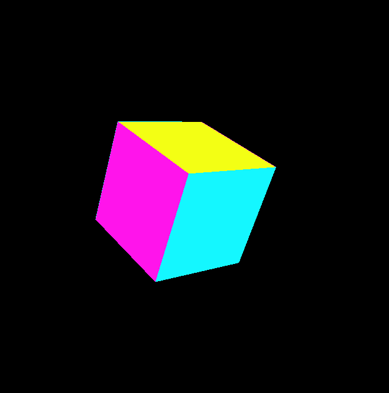

  
  
  <h3>A 3D cube rotating according to mouse movement. </h3>

<a href="https://openprocessing.org/sketch/1279127"><h3 align="center">Try me!</h3></a>
  
## Technologies Used

&nbsp;&nbsp;&nbsp;&nbsp;&nbsp;&nbsp;

## License

Copyright (c) 2022 Michael Kolesidis 
Licensed under the [GNU General Public License v3.0](https://github.com/michaelkolesidis/webproject-script/blob/main/LICENSE).

[//]: # (Free Software)

   
   

  

                                                       

  

